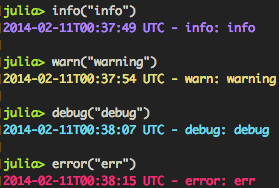

Lumberjack.jl
=============

[](https://travis-ci.org/forio/Lumberjack.jl)


## Quick Start
```julia
Pkg.add("Lumberjack")
```

### Create logs
```julia
julia> using Lumberjack

julia> debug("something innocuous happened!")
2013-12-02T19:39:16.123 UTC - debug:"something innocuous happened!"

julia> info("using more memory!", {:mem_allocated => 9001, :mem_left => 22})
2013-12-02T19:39:21.345 UTC - info:"using more memory!" mem_allocated:9001 mem_left:22

julia> warn("running really low on memory...", {:mem_left => "22 k"})
2013-12-02T19:39:44.456 UTC - warn:"running really low on memory..." mem_left:"22 k"

julia> try
         error("OUT OF MEMORY - IT'S ALL OVER - ARRGGGHHHH")
       catch err
         # Acts like Base.error, throws an `ErrorException`
       end
2013-12-02T19:39:48.678 UTC - error:"OUT OF MEMORY - IT'S ALL OVER - ARRGGGHHHH"

julia> log("info", "use `log` for user-defined modes, or to be verbose.")
2013-12-12T23:58:56.890 UTC - info:"use `log` for user-defined modes, or to be verbose."
```

### Add and remove `TimberTrucks`
Logs are brought to different output streams by `TimberTrucks`. To create a truck that will dump logs into a file, simply:
```julia
julia> Lumberjack.add_truck(LumberjackTruck("mylogfile.log"), "my-file-logger")
```
Now there is a truck named "my-file-logger", and it will write all of your logs to `mylogfile.log`. Your logs will still show up in the console, however, because -by default- there is a truck named "console" already hard at work. Remove it by calling:
```julia
julia> Lumberjack.remove_truck("console")
```

### Manage logging modes / levels
Each timber truck is configured to log messages _above_ a certain level / mode, and by default they will log everything. There are 4 built-in modes: `["debug", "info", "warn", "error"]`. To create a timber truck that will only record warnings and errors, you can:
```julia
julia> Lumberjack.add_truck(LumberjackTruck(STDOUT, "warn"), "dangerous-logger")
```

Or to configure an existing truck, you can call:
```
julia> configure(timber_truck; mode = "warn")
```

See [Log Level Example](#log-level-example) below.

### Logging Options
`Lumberjack.add_truck` provides an optional third `Dict` argument. Possible keys are:

#### is_colorized
Colors can be added enabled using the following:

```julia
Lumberjack.add_truck(LumberjackTruck(STDOUT, nothing, {:is_colorized => true}), "console")
```



By default the following colors are used:
```julia
{"debug" => :cyan, "info" => :blue, "warn" => :yellow, "error" => :red}
```

#### colors
Custom colors/log levels can also be specified:
```julia
Lumberjack.add_truck(LumberjackTruck(STDOUT, nothing, :colors => {"debug" => :black, "info" => :blue, "warn" => :yellow, "error" => :red, "crazy" => :green}), "console")
```

#### uppercase
Log levels can be made uppercase (INFO vs info, etc.) with the following option:
```julia
Lumberjack.add_truck(LumberjackTruck(STDOUT, nothing, {:uppercase => true}), "console")
```

## Architecture

There are three main components of Lumberjack.jl that you can manipulate:

### LumberMill

A lumber mill holds information needed to manage the whole process of creating and storing logs. There is a global `_lumber_mill` inside the `Lumberjack` module and, in all likelyhood, you wont need to create another. All exported api methods that accept a `LumberMill` will be overloaded to use `_lumber_mill` by default.

### Saw functions

A saw function simply takes in a dict of parameters, adds or removes things, and then returns the dict back. By default, the `date_saw` is applied to logs that come in and appends `date => DateTime.now()`.

### TimberTruck

Timber trucks are used to send logs to their final destinations (files, the console, etc). A timber truck inherits from the abstract type `TimberTruck` and overloads the `log(t::TimberTruck, args::Dict)` function. By default, the framework will create a `LumberjackLog` truck that will print `args` as a string of `key:value` pairs to STDOUT.


## API

### Logging
```julia
log(lm::LumberMill, mode::String, msg::String, args::Dict)
```
+ `mode` is a string like "debug", "info", "warn", "error", etc
+ `msg` is an explanative message about what happened
+ `args` is an optional dictionary of data to be recorded alongside `msg`


```julia
debug(lm::LumberMill, msg::String, args::Dict)
info(lm::LumberMill, msg::String, args::Dict)
warn(lm::LumberMill, msg::String, args::Dict)
error(lm::LumberMill, msg::String, args::Dict)
```
+ each call `log` with `mode` filled in appropriately


### Saws
```julia
add_saw(lm::LumberMill, saw_fn::Function, index)
```
+ `index` is optional and will default to the end of the saw list


```julia
remove_saw(lm::LumberMill, index)
```
+ `index` is optional, by default the last saw in the list will be removed


```julia
remove_saws(lm::LumberMill)  # removes ALL saws currently in use
```


### Trucks
```julia
add_truck(lm::LumberMill, truck::TimberTruck, name)
```
+ `name` is optional and will default to a unique id


```julia
remove_truck(lm::LumberMill, name)
```
+ `name` is the id associated with the truck to be removed


```julia
remove_trucks(lm::LumberMill)  # removes ALL trucks currently in use
```


### Configuration
```julia
configure(lm::LumberMill; modes = ["debug", "info", "warn", "error"])
```
+ `modes` is an ordered array of logging levels


## Recipes and Examples

### Log Level Example

```julia
julia> using Lumberjack

# We already have console output of all modes/log levels via the default console truck.

# Let's add a truck that will ignore debug messages (only outputting warning-level and up).
julia> add_truck(JsonTruck(STDOUT, "info"), "json-logger")
Lumberjack.JsonTruck(Base.TTY(open, 0 bytes waiting),"info")

# Let's add another that will only output logs at warning-level and above.
julia> add_truck(LumberjackTruck(STDOUT, "warn"), "new-logger")
Lumberjack.LumberjackTruck(Base.TTY(open, 0 bytes waiting),"warn",Dict{Any,Any}(:is_colorized=>false,:uppercase=>false))

# Warnings should show up for all three trucks: json-logger, new-logger, console (default).
julia> Lumberjack.warn("Message")
{"date":"2015-11-16T12:09:57","msg":"Message","mode":"warn"}
2015-11-16T12:09:57 - warn: Message
2015-11-16T12:09:57 - warn: Message

# Info is less important than a warning, so won't show up for new-logger.
julia> Lumberjack.info("Something")
{"date":"2015-11-16T12:10:09","msg":"Something","mode":"info"}
2015-11-16T12:10:09 - info: Something

# Debug level isn't important enough to log for either json-logger or new-logger.
julia> Lumberjack.debug("Not very important")
2015-11-16T12:10:15 - debug: Not very important
```

### Including Additional Fields

Additional parameters may be specified in calls to `log` (and `debug`, `info`, `warn`, and `error`) by passing a `Dict` as the final positional argument. This is useful if you'd like to specify values for fields other than `mode` and `msg` that are not provided by saws.

These additional parameters can also be specified with keyword arguments:

```julia
julia> using Lumberjack

# The easy way.
julia> Lumberjack.warn("Something happened."; id="LoggingTest", impact="None, really.", resolve="Next steps.", cause="Needed an example.")
2015-11-16T15:23:54 - warn: Something happened. resolve: "Next steps." id: "LoggingTest" cause: "Needed an example." impact: "None, really."

# The hard(er) way.
julia> Lumberjack.warn("Something happened.", Dict{Any, Any}(:id=>"LoggingTest", :impact=>"None, really.", :resolve=>"Next steps.", :cause=>"Needed an example."))
2015-11-16T15:24:54 - warn: Something happened. resolve: "Next steps." id: "LoggingTest" cause: "Needed an example." impact: "None, really."
```

### Syslog and Stack Trace Example

Please note that syslog output is only available on systems that have `logger` utility installed. (This should include both Linux and OS X, but typically excludes Windows.)

```julia
julia> using Lumberjack

# Output to syslog on facility "local0", with tag "julia", and include Julia's process ID.
julia> syslog_io = Syslog(:local0, "julia", true)
Lumberjack.Syslog(:local0,"julia",63474)

# Send logs in JSON format to syslog_io, but only if they're warnings or above.
julia> add_truck(JsonTruck(syslog_io, "warn"), "syslog-json")
Lumberjack.JsonTruck(Lumberjack.Syslog(:local0,"julia",63474),"warn")

# Add a stacktrace to each log entry.
add_saw(Lumberjack.stacktrace_saw)
2-element Array{Any,1}:
 Lumberjack.msec_date_saw 
 Lumberjack.stacktrace_saw

julia> log("crit", "Critical message!")
julia> log("error", "Error message!")
julia> log("warn", "Warning message!")
julia> log("info", "Info message!")
```

Run `tail /var/log/system.log` (modifying as needed, depeding on where your system stores its logs) and you should see something like this:

```
Nov 16 15:00:03 localhost julia[63474]: {"stacktrace":[{"name":"eval_user_input","file":"REPL.jl","line":62},{"name":"anonymous","file":"REPL.jl","line":92}],"date":"2015-11-16T15:00:03","msg":"Critical message!","mode":"crit"}
Nov 16 15:00:33 localhost julia[63474]: {"stacktrace":[{"name":"eval_user_input","file":"REPL.jl","line":62},{"name":"anonymous","file":"REPL.jl","line":92}],"date":"2015-11-16T15:00:33","msg":"Error message!","mode":"error"}
Nov 16 15:00:45 localhost julia[63474]: {"stacktrace":[{"name":"eval_user_input","file":"REPL.jl","line":62},{"name":"anonymous","file":"REPL.jl","line":92}],"date":"2015-11-16T15:00:45","msg":"Warning message!","mode":"warn"}
```

The info message is missing because we set our truck to only output logs at warning level and above.

Note that BSD's `logger` (used on OS X) will append a second process ID, which is the PID of the `logger` tool itself.
